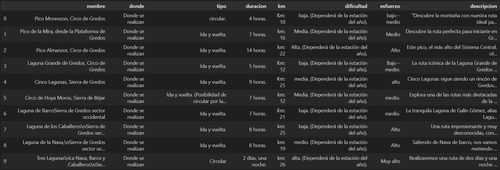

# Ejercicio de práctica de Beautiful Soup

## Objetivo:

El objetivo de este repositorio es tener el material necesario para realzar una práctica de extracción y limpieza de datos con Beautiful Soup.

## Estructura:

- images: 
    - imágenes incluidas en el Readme
- src:
    - soporte.py: contiene el Html de la página de la que vamos a extraer los datos. Simula el .content que obtenemos con request.get

- web.html: archivo que nos permite abrir la versión de la página web en nuestro navegador de forma local. 

- solución.ipynb: Jupyter Notebook con la solución del ejercicio.

- practica.ipynb: Jupyter Notebook para la práctica del ejercicio. Contiene los primeros pasos que simulan la extracción con request.get

## Instrucciones:

- Abre el archivo web.html en tu navegador para poder visualizar y explorar la página web.

- Abre el archivo practica.ipynb y ejecuta las primeras celdas del código para tener la variable necesaria para crear la "sopa".

## Objetivo del ejercicio:

El objetivo de este ejercicio es obtener todos los datos de las distintas rutas de montaña que hay en la página web. Busca patrones y elementos comunes para opcimar el proceso de extracción.

Los datos que necesitamos de cada ruta son:
- Nombre
- Dónde se realiza
- Tipo de ruta
- Duración
- Km
- Dificultad
- Esfuerzo
- Descripción

Esta es una muestra del output esperado:

La limpieza de los datos realizados en el archivo de solución es la mínima. Intenta mejorar esa limpieza para mostrar los datos con un formato cmás correcto y homogeneizado.

## Librerías:

- [Pandas](https://pandas.pydata.org/docs/reference/io.html) 🐼

    Pandas es una biblioteca poderosa para la manipulación y análisis de datos estructurados. Proporciona estructuras de datos flexibles y expresivas como DataFrames, que permiten realizar operaciones de limpieza, transformación, agregación y visualización de datos de manera eficiente. Es una herramienta esencial para el análisis de datos en Python.

- [BeautifulSoup](https://www.crummy.com/software/BeautifulSoup/bs4/doc/)

    BeautifulSoup es una biblioteca de Python para extraer datos de archivos HTML y XML. Permite navegar por el árbol de documentos y buscar elementos específicos mediante selectores CSS o métodos de búsqueda. Es especialmente útil para tareas de web scraping, donde se necesita extraer información de páginas web de manera automatizada.

- [Requests](https://requests.readthedocs.io/en/latest/)

    La biblioteca `requests` permite enviar solicitudes HTTP de manera sencilla y eficiente. Se utiliza para interactuar con servicios web y APIs, obtener datos de páginas web, enviar datos a un servidor, entre otros. Es una herramienta fundamental para el scraping de datos y la comunicación con servicios web.

- [Regex](https://docs.python.org/es/3/library/re.html)

    La biblioteca `re` proporciona herramientas para trabajar con expresiones regulares en Python. Las expresiones regulares son secuencias de caracteres que forman un patrón de búsqueda, utilizadas para hacer coincidir y manipular cadenas de texto. Son útiles para validar, buscar y reemplazar patrones en textos, como direcciones de correo electrónico, números de teléfono, etc.

